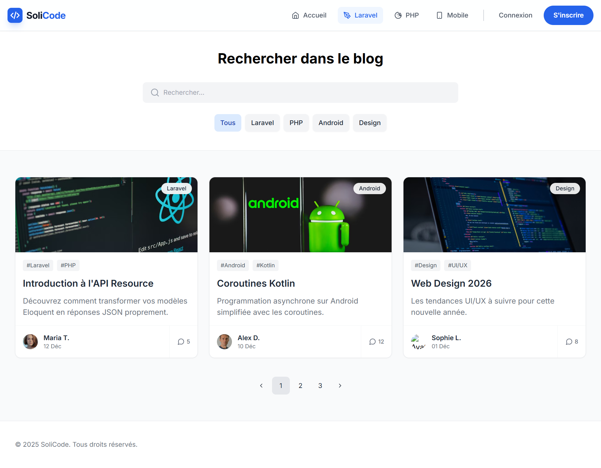
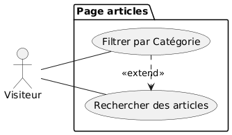

# **Rapport Complet sur le Projet Blog Solicode : Sprint 1**

**Réalisé par :**  
BENYEKHLEF Anouar    

**Encadré par :**  
M. ESSARRAJ Fouad

---

# Introduction et Contexte Général

Le projet Blog Solicode vise à créer une plateforme numérique dédiée pour communiquer les activités parascolaires de l'organisation, notamment IT-Wave.

Les réseaux sociaux présentent des limitations en termes de référencement SEO, de structuration des contenus et d'identité propre, menant à une dispersion des informations.

La solution : Une plateforme de blog dynamique, sécurisée et scalable, alignée sur des pratiques standard pour organisations éducatives.

---

# Analyse des Besoins

- **Communication centralisée** : Canal unique pour articles, événements et actualités IT-Wave.
- **Limites des réseaux sociaux** : Manque de SEO, structuration faible, absence d'identité dédiée.
- **Objectifs stratégiques** : Améliorer visibilité, découverte de contenus, scalabilité (e.g., commentaires, newsletters).

Études montrent que les blogs dédiés boostent le trafic organique pour ~55-70% des organisations, selon des sources comme HubSpot et Databox.

---

# Méthodologies Employées

## Méthode Scrum

Structure en sprints (2 semaines) :

- **Rôles** : Product Owner, Scrum Master, Équipe.
- **Artefacts** : Backlogs, Increment.
- **Événements** : Planning, Daily, Review, Retrospective.

Permet adaptation rapide et livraison incrémentale.

---

# Méthodologies Employées (suite)

## Design Thinking

Processus itératif centré utilisateur :

1. **Empathie** : Comprendre besoins.
2. **Définition** : Identifier problèmes.
3. **Ideation** : Brainstorming solutions.
4. **Prototypage** : Maquettes.
5. **Tests** : Validation utilisateurs.

Combinées pour développement efficace.

---

# Détails du Sprint 1 : Portail Web Public

Focus sur front-office accessible aux visiteurs anonymes.

Fonctionnalités clés :
- **Page d’accueil** : Articles récents, catégories.
- **Navigation** : Menu intuitif.
- **Recherche** : Moteur.
- **Lecture d’articles** : Affichage détaillé.

Établit bases pour expérience engageante.

---

# Travail Réalisé

## Focus Principal : Page de Recherche d'Articles

- **Fonctionnalités** :
  - Recherche full-text.
  - Filtrage dynamique par catégories.

## Labs et Recherches
- Vite pour bundling et hot-reloading front-end.

---

# Maquettes et Tests Utilisateurs

- **Maquette clé** : Page articles avec recherche, UX moderne.
- **Outils** : Tailwind CSS (utility-first), Preline UI (composants), Lucide (icons).
- **Tests** : Avec **Ayoub Faqihi** (apprenant 1ère année). 
Retours : Intuitive, suggestions sur visibilité filtres.

---

---

# Fonctionnalités Détaillées

Page de recherche suit use case :
- **Acteurs** : Visiteur.
- **Flux** : Requête → Résultats → Filtrage → Lecture.
- **Bénéfices** : Réduction temps recherche, personnalisation.

---

# Réalisation Technique Approfondie

## Back-End et Architecture
- **Framework** : Laravel 12.
- **Architecture N-Tiers** :
  - Controller : Requêtes HTTP.
  - Service : Logique métier.
  - Model : Base de données.
- Avantages : Scalabilité, testabilité.

---

# Réalisation Technique (suite)

## Front-End
- **Blade** : Templates réutilisables (components, layouts).
- **Tailwind CSS** : Développement rapide, responsive.
- **Preline UI** : Composants intégrés.
- **Lucide** : Icones.

## Gestion de Projet
- **GitHub** : Versionning, branches.

---

# Conclusion et Recommandations

 - Sprint 1 solidifie fondations : Structure claire, architecture scalable, UX testée.

Retours positifs valident approche ; ajustements pour accessibilité.

Prochains sprints : Fonctionnalités avancées (admin, interactions).

Merci pour votre attention.  
Questions ?

